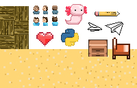
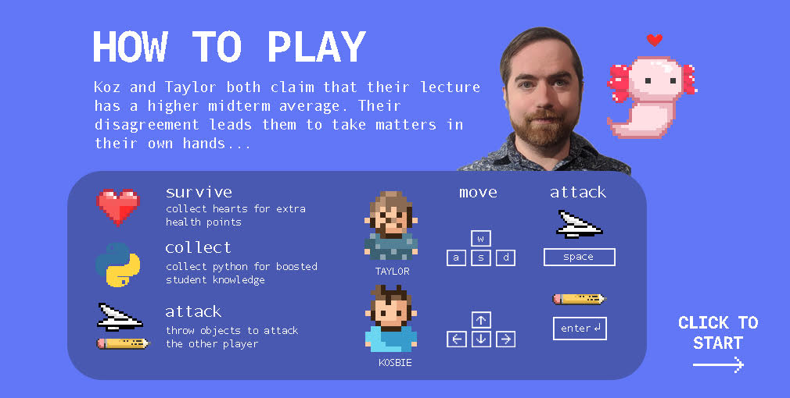

# 112.io

Have you ever wondered what goes on behind the scenes before your 15-112 lectures? While you're sitting in lecture, do you ever wonder what Professor Kosbie thinks of Professor Taylor and what Professor Taylor thinks of Professor Kosbie? 

112.io is a **very accurate** 112-themed two-player game in which Kosbie and Taylor battle it out *elbow-to-elbow* in a very intense game of... install the game to find out!


## Installation

The game is created using Pygame, so use the package manager [pip](https://pip.pypa.io/en/stable/) to install pygame. 

```bash
pip install pygame
```

## Usage
Run the main.py function in the Elbows repository

```python
import pygame

```

## Visuals
All of the images created in the game was made using Adobe Photoshop and drawn with... an apple trackpad rip :+1:






## License
[MIT](https://choosealicense.com/licenses/mit/)